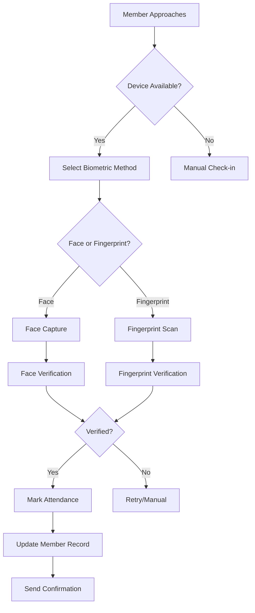

# 🖐️ FINGERPRINT DEVICE CONNECTION & ATTENDANCE FLOW GUIDE

## 📱 SUPPORTED FINGERPRINT DEVICES

### 🌏 International Brands
- **HID DigitalPersona** (4500, 4000B, 5300)
- **SecuGen** (Hamster Pro 20, Hamster Plus)
- **ZKTeco** (SLK20R, ZK4500, ZK6500)
- **Suprema** (BioMini Plus 2, BioMini Slim 3)
- **Futronic** (FS80, FS88, FS90)
- **Morpho** (MSO 1300 E3, MSO 1350)

### 🇮🇳 Popular Indian Brands
- **Mantra** (MFS100, MFS110, MFS500)
- **Bio-Max** (NB-2020-U, NB-1010-U)
- **MX Biometric** (MX100, MX110)
- **Time Dynamo** (FM220U, FM100)
- **Startek** (FM220U Plus)
- **Evolute** (Columbo, Falcon)
- **Precision** (PB510, PB515)

## 🔧 DEVICE CONNECTION PROCESS

### Step 1: Physical Connection
```bash
1. Connect fingerprint scanner via USB port
2. Windows will auto-detect the device
3. Install drivers (usually automatic)
4. Verify device appears in Device Manager
```

### Step 2: Driver Installation
```bash
# For most devices, Windows will auto-install drivers
# If manual installation needed:
1. Download manufacturer drivers
2. Right-click device in Device Manager
3. Update driver software
4. Browse to downloaded driver folder
```

### Step 3: Verify Detection
Run your enhanced hardware detection script:
```batch
.\hardware-detection.bat
```

Expected output for connected device:
```
📱 Scanning for Fingerprint Devices...
----------------------------------------
COMPUTER,USB\VID_1234&PID_5678,Mantra MFS100 Fingerprint Scanner

🇮🇳 Scanning for Indian Fingerprint Scanner Brands...
------------------------------------------------------
COMPUTER,USB\VID_1234&PID_5678,Mantra MFS100 Fingerprint Scanner
```

## 🏃‍♂️ COMPLETE ATTENDANCE FLOW WITH MEMBER DATA

### 🎯 Overview of the Process



### 🔄 Step-by-Step Attendance Flow

#### Phase 1: Member Enrollment (One-time Setup)
```javascript
// 1. Admin selects member from database
const member = await Member.findById(memberId);

// 2. Choose biometric method (Face + Fingerprint recommended)
const enrollmentData = {
    personId: member._id,
    personType: 'Member',
    gymId: member.gym,
    deviceId: 'selected_device_id'
};

// 3. Face Enrollment
const faceEnrollment = await biometricAgent.enrollFace(enrollmentData);
// Result: Template stored with member ID

// 4. Fingerprint Enrollment  
const fingerprintEnrollment = await biometricAgent.enrollFingerprint(enrollmentData);
// Result: Fingerprint template stored with member ID
```

#### Phase 2: Daily Attendance Check-in
```javascript
// 1. Member approaches biometric device
// 2. System captures biometric data
// 3. Verification process

const attendanceFlow = {
    // Step 1: Capture biometric
    capture: async (deviceId, biometricType) => {
        if (biometricType === 'face') {
            return await faceRecognitionService.captureFace(deviceId);
        } else {
            return await fingerprintService.captureFingerprint(deviceId);
        }
    },
    
    // Step 2: Verify against enrolled templates
    verify: async (capturedData, gymId) => {
        const templates = await BiometricData.find({ 
            gymId, 
            isActive: true 
        });
        
        for (let template of templates) {
            const confidence = await compareTemplates(capturedData, template);
            if (confidence > 0.8) { // 80% threshold
                return {
                    verified: true,
                    personId: template.personId,
                    confidence: confidence
                };
            }
        }
        
        return { verified: false };
    },
    
    // Step 3: Mark attendance
    markAttendance: async (verificationResult) => {
        if (verificationResult.verified) {
            const member = await Member.findById(verificationResult.personId);
            
            const attendance = new Attendance({
                gymId: member.gym,
                personId: member._id,
                personType: 'Member',
                memberName: member.memberName,
                date: new Date(),
                checkInTime: new Date(),
                status: 'present',
                authenticationMethod: 'biometric',
                biometricData: {
                    confidence: verificationResult.confidence,
                    deviceId: deviceId,
                    templateMatched: true
                }
            });
            
            await attendance.save();
            return attendance;
        }
    }
};
```

### 📊 MEMBER DATA INTEGRATION

#### Member Database Schema
```javascript
// Your existing Member model structure
const memberSchema = {
    _id: ObjectId,
    memberName: String,
    email: String,
    phone: String,
    gym: ObjectId, // Reference to gym
    membershipId: String,
    paymentStatus: String,
    planSelected: String,
    // Biometric data will be stored separately
    biometricEnrolled: {
        face: Boolean,
        fingerprint: Boolean,
        enrollmentDate: Date
    }
};
```

#### Biometric Data Schema
```javascript
// BiometricData model (already exists)
const biometricSchema = {
    gymId: ObjectId,
    personId: ObjectId, // Links to Member._id
    personType: String, // 'Member' or 'Trainer'
    biometricType: String, // 'face', 'fingerprint', 'both'
    
    // Face data
    faceData: {
        template: String, // Encrypted template
        quality: Number,
        enrollmentDate: Date,
        templateId: String
    },
    
    // Fingerprint data
    fingerprintData: {
        template: String, // Encrypted template
        quality: Number,
        enrollmentDate: Date,
        templateId: String
    },
    
    isActive: Boolean,
    enrollmentDevice: {
        deviceId: String,
        deviceType: String
    }
};
```

#### Attendance Record Schema
```javascript
// Attendance model (already exists)
const attendanceSchema = {
    gymId: ObjectId,
    personId: ObjectId, // Links to Member._id
    personType: String,
    memberName: String, // For quick display
    date: Date,
    checkInTime: Date,
    checkOutTime: Date,
    status: String, // 'present', 'absent'
    authenticationMethod: String, // 'biometric', 'manual', 'qr'
    
    biometricData: {
        biometricType: String, // 'face' or 'fingerprint'
        confidence: Number, // Verification confidence (0-1)
        deviceId: String,
        templateMatched: Boolean,
        verificationTime: Number // Milliseconds
    }
};
```

### 🖥️ REAL-TIME ATTENDANCE DASHBOARD

#### For Gym Admin
```javascript
// Real-time attendance monitoring
const attendanceStats = {
    today: {
        totalCheckins: await Attendance.countDocuments({
            gymId: gymId,
            date: { $gte: startOfDay, $lte: endOfDay }
        }),
        
        biometricCheckins: await Attendance.countDocuments({
            gymId: gymId,
            date: { $gte: startOfDay, $lte: endOfDay },
            authenticationMethod: 'biometric'
        }),
        
        averageConfidence: await Attendance.aggregate([
            { $match: { gymId: gymId, 'biometricData.confidence': { $exists: true } } },
            { $group: { _id: null, avg: { $avg: '$biometricData.confidence' } } }
        ])
    }
};
```

### 🔄 COMPLETE WORKFLOW EXAMPLE

```javascript
// Example: Complete member check-in flow
async function memberCheckIn(deviceId, biometricType) {
    try {
        console.log(`🔍 Starting ${biometricType} verification...`);
        
        // Step 1: Capture biometric data
        const captureResult = await biometricAgent.capture(deviceId, biometricType);
        if (!captureResult.success) {
            return { error: 'Failed to capture biometric data' };
        }
        
        // Step 2: Verify against enrolled members
        const verifyResult = await biometricAgent.verify(deviceId, captureResult.data);
        if (!verifyResult.verified) {
            return { error: 'Member not recognized' };
        }
        
        // Step 3: Get member details
        const member = await Member.findById(verifyResult.personId);
        if (!member) {
            return { error: 'Member not found in database' };
        }
        
        // Step 4: Check membership status
        if (member.paymentStatus !== 'paid') {
            return { 
                error: 'Membership payment pending',
                member: member.memberName,
                action: 'redirect_to_payment'
            };
        }
        
        // Step 5: Mark attendance
        const attendance = new Attendance({
            gymId: member.gym,
            personId: member._id,
            personType: 'Member',
            memberName: member.memberName,
            date: new Date(),
            checkInTime: new Date(),
            status: 'present',
            authenticationMethod: 'biometric',
            biometricData: {
                biometricType: biometricType,
                confidence: verifyResult.confidence,
                deviceId: deviceId,
                templateMatched: true,
                verificationTime: verifyResult.processingTime
            }
        });
        
        await attendance.save();
        
        // Step 6: Return success response
        return {
            success: true,
            member: {
                name: member.memberName,
                membershipId: member.membershipId,
                plan: member.planSelected
            },
            attendance: {
                checkInTime: attendance.checkInTime,
                confidence: `${(verifyResult.confidence * 100).toFixed(1)}%`
            },
            message: `Welcome ${member.memberName}! Check-in successful.`
        };
        
    } catch (error) {
        console.error('Check-in error:', error);
        return { error: 'System error during check-in' };
    }
}
```

### 🎯 PRACTICAL IMPLEMENTATION

#### For Your Gym Setup:

1. **Device Placement**: Position fingerprint scanner at entrance
2. **Member Training**: Show members how to place finger correctly
3. **Backup System**: Keep face recognition as backup method
4. **Admin Interface**: Use existing gym admin panel for enrollment
5. **Reporting**: Real-time attendance dashboard

#### Expected Performance:
- **Fingerprint Verification**: 1-3 seconds
- **Face Verification**: 2-4 seconds  
- **Accuracy**: 95%+ with quality enrollment
- **False Acceptance**: <0.1%
- **False Rejection**: <5%

This system integrates seamlessly with your existing member database and provides a complete biometric attendance solution!
